`docs/web/OPUS-X-VISION-2035-2026-07-26.md` · Vision Paper — famille « vision », HORS CORPUS · scellé le 2026-07-26

**Provenance — en-tête inscrit par Opus X (Canonical Registry) ; corps du document NON reformaté :**

- **Type** : Vision Paper — non normatif — HORS CORPUS
- **Statut** : Draft 3.0
- **Vision rédigée par l'architecte** : 2026-07-25
- **Rédaction du document (itération V3)** : 2026-07-26
- **Le corpus prévaut en cas de divergence.**

---

# Opus X Vision 2035
### La couche mondiale de confiance pour l'identité professionnelle
#### Un texte fondateur pour l'ère de la coordination autonome

---

**Type de document** — Vision Paper
**Statut** — Non normatif · Document de réflexion stratégique · **Draft — itération 3**
**Effet sur le corpus** — Aucun. Ce document ne crée, ne modifie et n'abroge aucune règle.
**Version** — 3.0 (Draft)
**Public** — Équipe produit · Architectes · Développeurs · Partenaires · Investisseurs · Issuers · Organisations · Agents et systèmes autonomes

---

> **Note de statut.** Ce White Paper est un *document de vision*. Il décrit une trajectoire, non une norme. Il n'appartient pas au corpus normatif d'Opus X, ne possède aucun effet rétroactif, et ne saurait être cité comme une source de vérité opposable. Les fondations déjà scellées — le protocole, la propriété des données, la confidentialité du Passport — demeurent la seule référence contraignante. Lorsque ce document et le corpus semblent diverger, le corpus prévaut, sans exception. Les idées de ce document qui mériteront un jour de devenir des règles feront l'objet de *Foundation Documents* ou de *Standards* rédigés spécifiquement à cette fin.

---

## Table des matières

- [Synthèse exécutive](#synthèse-exécutive)
- [Préambule — Ce que nous avons compris](#préambule--ce-que-nous-avons-compris)
- [1. Les infrastructures de civilisation](#1-les-infrastructures-de-civilisation)
- [2. Connaissance, confiance, coordination](#2-connaissance-confiance-coordination)
- [3. Le problème de la confiance — une histoire courte](#3-le-problème-de-la-confiance--une-histoire-courte)
- [4. Pourquoi une nouvelle vision](#4-pourquoi-une-nouvelle-vision)
- [5. Les limites des modèles actuels](#5-les-limites-des-modèles-actuels)
- [6. Le véritable actif stratégique](#6-le-véritable-actif-stratégique)
- [7. Le rôle du protocole](#7-le-rôle-du-protocole)
- [8. Les couches d'architecture](#8-les-couches-darchitecture)
- [9. Les trois catégories de consommateurs](#9-les-trois-catégories-de-consommateurs)
- [10. Les agents et les réseaux d'agents](#10-les-agents-et-les-réseaux-dagents)
- [11. Pourquoi les intelligences artificielles ne se feront pas confiance entre elles](#11-pourquoi-les-intelligences-artificielles-ne-se-feront-pas-confiance-entre-elles)
- [12. La mémoire externe des machines](#12-la-mémoire-externe-des-machines)
- [13. Le Canonical Knowledge Engineering](#13-le-canonical-knowledge-engineering)
- [14. Architecture GEO](#14-architecture-géo)
- [15. Architecture documentaire](#15-architecture-documentaire)
- [16. L'écosystème](#16-lécosystème)
- [17. Le coût de coordination](#17-le-coût-de-coordination)
- [18. La dimension économique](#18-la-dimension-économique)
- [19. Vision à dix ans](#19-vision-à-dix-ans)
- [Conclusion — L'infrastructure de la décision](#conclusion--linfrastructure-de-la-décision)
- [Principe directeur](#principe-directeur)
- [Glossaire des termes réservés](#glossaire-des-termes-réservés)

---

## Synthèse exécutive

Ce document formule, à un niveau de rigueur destiné à durer, ce qu'Opus X cherche réellement à construire, pourquoi le monde en aura besoin, et pourquoi cette évolution est presque inévitable.

**La thèse centrale.** Une civilisation progresse lorsqu'elle augmente sa capacité à coordonner des acteurs qui ne se connaissent pas. Cette coordination repose sur la confiance ; cette confiance, à grande échelle, repose sur une connaissance vérifiable. Les grandes infrastructures de l'histoire — le langage, les routes, la monnaie, le droit, les réseaux d'information — ont chacune élargi ce cercle de coordination en réduisant un coût. Opus X ajoute la couche suivante : la confiance vérifiable dans ce que les acteurs savent faire. Sa valeur profonde n'est pas de vérifier des compétences ; c'est de **réduire le coût de la coordination** entre acteurs qui ne se connaissent pas — humains comme machines.

**Le problème qui rend cette couche nécessaire.** Les réseaux d'information ont produit une abondance sans fournir de moyen d'en vérifier la fiabilité. L'intelligence artificielle rend la production d'information plausible quasi gratuite, brouillant la frontière entre l'affirmé et le fondé. Les systèmes autonomes rendent ce problème critique : lorsqu'une machine n'agit plus en répondant mais en décidant et en exécutant, elle a besoin de savoir, de façon vérifiable, à quoi se fier.

**L'actif stratégique.** Il ne réside pas dans la possession de la connaissance. Les professionnels restent propriétaires de leurs données ; Opus X ne possède ni les compétences ni les preuves. L'actif est la capacité à fournir une infrastructure de confiance neutre, fiable et interopérable — la condition d'une coordination universelle.

**Le protocole.** Opus X est la première implémentation d'un protocole qui lui reste supérieur et indépendant. Cette séparation garantit pérennité, interopérabilité et neutralité, et impose qu'Opus X demeure remplaçable pour que la connaissance qu'il sert ne le soit jamais.

**Les consommateurs et leurs réseaux.** Aux professionnels et aux organisations s'ajoutent les systèmes autonomes, qui opèrent en réseaux. Or une intelligence artificielle n'accordera jamais une confiance aveugle à une autre : elle exigera preuves, provenance, définitions, version et source. Les agents auront donc besoin d'une infrastructure externe, plus robuste qu'une confiance distribuée entre eux.

**La mémoire externe et la discipline nouvelle.** Les humains ont une mémoire biologique, les organisations une mémoire documentaire ; les systèmes autonomes s'appuieront sur une mémoire externe. Devenir la mémoire externe de référence, pour un domaine, est une position déterminante. La discipline qui la produit — le *Canonical Knowledge Engineering* — succède au référencement traditionnel : il ne s'agit plus d'être trouvé, mais de devenir la source à partir de laquelle les machines décident et agissent.

**La compatibilité.** Cette vision ne modifie aucune fondation scellée. Elle est un déplacement de point de vue, pas un changement de règles.

**En une phrase.** Les réseaux d'information ont mondialisé l'information ; l'intelligence artificielle mondialise les décisions ; la prochaine infrastructure mondiale sera celle qui permettra à ces décisions de s'appuyer sur une connaissance vérifiable — et c'est la place qu'Opus X ambitionne d'occuper, sans jamais posséder la connaissance qui la fonde.

---

## Préambule — Ce que nous avons compris

Toute infrastructure durable naît d'une idée simple que l'on met des années à formuler correctement.

Au commencement d'Opus X, nous pensions construire une plateforme centrée sur un objet clair, le **Professional Passport**, destinée à aider un professionnel à démontrer ce qu'il sait faire. Cette intuition n'était pas fausse. Elle était incomplète.

En développant le système, en gravant ses fondations une à une, une compréhension différente a émergé. Le Passport n'est pas le cœur d'Opus X. Il en est une représentation — précieuse, visible, utile — mais une représentation parmi d'autres. Ce que nous construisons réellement se situe en dessous du Passport : une infrastructure permettant de **structurer, relier, vérifier et servir** une connaissance professionnelle appuyée par des preuves.

Mais ce document ne se contentera pas de décrire cette infrastructure. Il commencera plus haut et plus loin — par la question de savoir *pourquoi une civilisation a besoin d'infrastructures de confiance*, et pourquoi l'ère qui s'ouvre en rend une nouvelle inévitable. Ce n'est qu'ensuite qu'il descendra vers l'architecture. Car une infrastructure ne se justifie pas par ce qu'elle fait, mais par ce qu'elle rend possible — et ce qu'Opus X rend possible dépasse la vérification des compétences : c'est une coordination nouvelle entre des acteurs, humains et machines, qui ne se connaissent pas.

> **Vision.** Nous construisons la première infrastructure mondiale permettant aux humains, aux organisations et aux systèmes autonomes de comprendre, de vérifier et de coordonner des compétences professionnelles — une couche de confiance dont la connaissance est structurée, vérifiable et interopérable, sans jamais que cette connaissance ne cesse d'appartenir à ceux qui la produisent.

---

## 1. Les infrastructures de civilisation

Pour comprendre ce qu'Opus X ambitionne, il faut d'abord s'élever au-dessus d'Opus X, et regarder ce que sont les grandes infrastructures qui ont façonné l'histoire humaine. Elles partagent un trait unique et décisif.

### 1.1 Ce que font les grandes infrastructures

Une civilisation ne se mesure pas d'abord à ses monuments, mais à sa capacité à faire coopérer des gens qui ne se connaissent pas. Un village peut fonctionner sur la connaissance mutuelle : chacun sait qui est fiable. Une civilisation, non. Elle réunit des millions d'acteurs qui ne se rencontreront jamais, et qui doivent pourtant échanger, s'engager, se faire confiance. Toute l'histoire des grandes infrastructures est celle des inventions qui ont rendu cette coopération à distance possible.

Considérons-les.

**Le langage.** La première infrastructure. Il permet de coordonner la compréhension : transmettre une intention, un savoir, un avertissement, sans avoir à le redécouvrir soi-même. Le langage réduit le coût de se comprendre.

**Les routes.** Elles coordonnent le mouvement. Elles permettent aux biens, aux personnes et aux idées de circuler entre des lieux qui, sans elles, resteraient étrangers. Une route réduit le coût de la distance.

**La monnaie.** Elle coordonne l'échange. Avant elle, échanger supposait le troc — la coïncidence improbable de deux besoins exactement complémentaires. La monnaie permet à deux inconnus d'échanger sans se faire confiance personnellement, en faisant confiance à un instrument commun. Elle réduit le coût de transiger.

**Le droit.** Il coordonne la confiance. Il permet à deux étrangers de s'engager l'un envers l'autre en s'appuyant, non sur leur connaissance mutuelle, mais sur une règle commune qui rend l'engagement opposable. Le droit réduit le coût de faire confiance à un inconnu.

**Les réseaux d'information.** Ils coordonnent l'accès au savoir. Ils permettent à une information de devenir immédiatement disponible partout, effaçant la distance informationnelle. Ils réduisent le coût de communiquer.

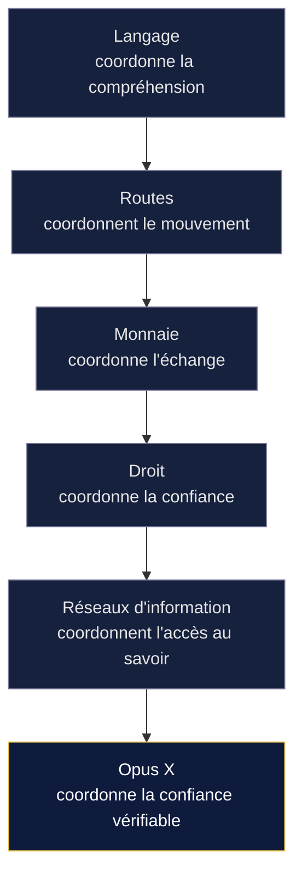

### 1.2 Le point commun, et le point suivant

Ces infrastructures n'ont rien en commun dans leur forme. Elles ont tout en commun dans leur fonction : chacune a élargi le cercle des acteurs capables de coopérer, en réduisant un coût qui, auparavant, rendait cette coopération trop chère ou trop risquée. Chacune a ajouté une couche à l'édifice de la coordination humaine, sans remplacer les précédentes. La monnaie n'a pas aboli le langage ; le droit n'a pas aboli les routes. Chaque couche s'est ajoutée aux autres.

Opus X s'inscrit dans cette continuité. Il ne remplace aucune de ces infrastructures. Il en ajoute une nouvelle, rendue nécessaire par une ère où les acteurs à coordonner ne sont plus seulement des humains, mais aussi des machines : **la confiance vérifiable dans ce qu'un acteur sait faire.**

> **Vision.** Les grandes infrastructures de civilisation ont chacune répondu à la même question sous une forme nouvelle : *comment coopérer avec quelqu'un que l'on ne connaît pas ?* Le langage, la monnaie, le droit ont repoussé cette limite tour à tour. Opus X la repousse pour l'ère qui vient — celle où il faudra coopérer non seulement avec des inconnus, mais avec des systèmes autonomes qui décident et agissent, et qui exigeront de savoir, de façon vérifiable, à qui et à quoi se fier.

---

## 2. Connaissance, confiance, coordination

Le chapitre précédent a montré que toute infrastructure de civilisation élargit la coordination. Celui-ci en tire le fil conducteur de tout le document — car la coordination est la clé qui explique *pourquoi* la connaissance et la confiance importent.

### 2.1 La chaîne fondamentale

Il existe une chaîne, simple et profonde, qui relie la connaissance à la civilisation.

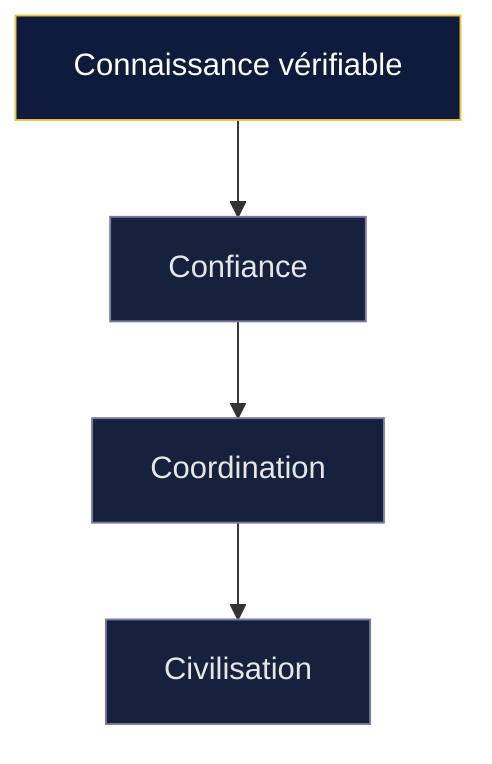

Une civilisation prospère à proportion de sa capacité à **coordonner** des acteurs qui ne se connaissent pas. Cette coordination n'est possible que s'il existe entre ces acteurs une **confiance** suffisante pour s'engager. Et cette confiance, dès qu'elle dépasse le cercle de la connaissance personnelle, ne peut reposer que sur une **connaissance vérifiable** — quelque chose que chacun peut contrôler sans avoir à croire l'autre sur parole.

Retirez un maillon, et l'édifice s'effondre. Sans connaissance vérifiable, la confiance redevient un pari. Sans confiance, la coordination se limite à ceux qui se connaissent. Sans coordination à grande échelle, la civilisation reste locale.

### 2.2 Ce qu'Opus X construit réellement

Cette chaîne éclaire la vraie nature d'Opus X. En apparence, Opus X vérifie des compétences professionnelles. En réalité, il alimente les trois premiers maillons de la chaîne au service du quatrième.

> **Vision.** Opus X ne construit pas seulement une infrastructure de confiance. Il construit une infrastructure qui rend possible une coordination nouvelle — entre professionnels et organisations qui ne se connaissent pas, et bientôt entre systèmes autonomes qui doivent agir ensemble sans pouvoir se fier les uns aux autres aveuglément. La confiance vérifiable n'est pas la fin ; elle est le moyen. La fin est la coordination.

Cette idée traverse tout le reste du document. Chaque fois qu'il sera question de connaissance canonique, de preuves reliées, de niveaux de confiance vérifiables, il faudra entendre, derrière, la même finalité : rendre possible une coordination qui, sans cette infrastructure, resterait trop coûteuse ou trop risquée pour avoir lieu.

---

## 3. Le problème de la confiance — une histoire courte

La chaîne du chapitre 2 explique pourquoi la confiance importe. Ce chapitre raconte pourquoi, à notre époque précisément, elle devient un problème critique que rien ne résout — et donc pourquoi une nouvelle infrastructure devient nécessaire.

### 3.1 Les réseaux d'information ont créé un problème de confiance

Les réseaux d'information ont résolu magistralement un problème — l'accès — et en ont créé un autre qu'ils n'ont jamais résolu : **comment savoir à quoi se fier ?**

Auparavant, la rareté de la publication faisait office de filtre grossier. Publier coûtait cher ; ce coût écartait une part du bruit. Les réseaux modernes ont supprimé ce coût. La conséquence fut une abondance sans précédent — et l'effondrement du filtre. Tout peut être publié, tout peut être affirmé, et rien, dans le médium lui-même, ne distingue une affirmation fondée d'une affirmation gratuite.

On a tenté de reconstruire un filtre par procuration : la popularité comme substitut de la fiabilité. Ce qui est le plus lié, le plus consulté, remonte. C'est une heuristique utile, mais c'est un aveu. La popularité n'est pas la vérité. Un contenu peut être massivement partagé et faux ; une source peut être rigoureuse et invisible. On a optimisé l'attention, pas la confiance.

Dans le domaine professionnel, ce défaut est aigu. Un profil, une page, un document se déclarent eux-mêmes. Rien, dans leur format, ne permet de vérifier ce qu'ils affirment sans un travail manuel, coûteux et non reproductible. La question *« que sait réellement faire cette personne, et pourquoi puis-je lui faire confiance ? »* se résout encore, pour l'essentiel, comme il y a un siècle : par la réputation, la recommandation, et un acte de foi.

> **Vision.** Les réseaux d'information ont fait de l'information une abondance et de la confiance une rareté. Le problème de l'époque qui s'ouvre n'est plus l'accès — il est réglé — mais la vérifiabilité. Toute infrastructure qui saura transformer une information abondante en connaissance vérifiable occupera une position que ces réseaux n'ont jamais su tenir.

### 3.2 L'intelligence artificielle amplifie ce problème

L'intelligence artificielle met cette confiance diluée sous une tension nouvelle.

Elle a rendu la production d'information plausible quasi gratuite. Un contenu cohérent, bien tourné, apparemment informé, peut désormais être généré en quantité illimitée, à un coût proche de zéro. Or la plausibilité était l'un des derniers indices de fiabilité qu'il nous restait : un contenu soigné *signalait* un effort, et l'effort *suggérait* un sérieux. Ce signal est rompu. La forme ne prouve plus rien, parce que la forme est devenue triviale à produire.

La conséquence est double. D'une part, le volume d'information non vérifiée croît encore. D'autre part — plus profond — les systèmes eux-mêmes consomment cette information pour composer leurs réponses. Un système qui s'appuie sur des sources non fiables propage l'erreur avec l'autorité tranquille d'une réponse bien formulée. La confusion entre *affirmé* et *fondé* devient systémique dès lors que des machines la reproduisent à grande échelle.

> **Note.** L'intelligence artificielle n'a pas créé le problème de confiance ; elle a supprimé les derniers indices imparfaits qui permettaient de le contourner. En rendant la plausibilité gratuite, elle rend la vérifiabilité indispensable. Ce qui était un confort devient une nécessité.

### 3.3 Les systèmes autonomes rendent ce problème critique

Tant qu'un système se contente de *répondre* à un humain, l'erreur reste rattrapable : l'humain lit, juge, corrige. Un dernier filtre subsiste.

Les systèmes autonomes suppriment ce filtre. Un agent ne répond pas seulement : il **décide** et il **agit**. Il présélectionne, valide, engage une étape dont les conséquences sont réelles. À ce moment, la confiance n'est plus un confort de lecture ; elle est la condition de sûreté de l'action. Un agent qui agit sur une information fausse ne produit pas une réponse imparfaite : il produit une décision erronée, à la vitesse et à l'échelle de la machine.

Un agent ne peut pas *avoir une impression*. Il lui faut des faits qu'il puisse lire, relier, vérifier et pondérer. Là où un humain compense l'absence de structure par son intuition, un agent n'a que la structure. Privé d'une source fiable, il n'a le choix qu'entre croire sur parole ou tenter une vérification qu'il n'a pas les moyens de mener correctement.

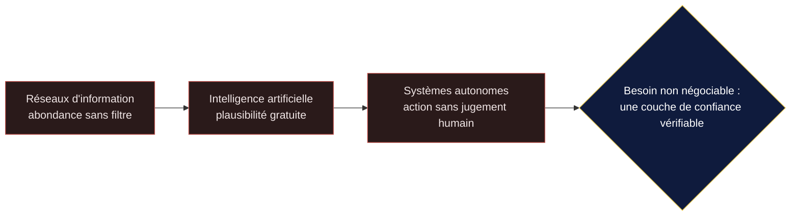

### 3.4 Pourquoi Opus X devient nécessaire

Mettons les trois mouvements bout à bout. Les réseaux ont créé l'abondance sans la confiance. L'intelligence artificielle a effacé les derniers indices de fiabilité. Les systèmes autonomes transforment l'information en action, supprimant le dernier filtre humain. À chaque étape, le même manque se creuse : **il n'existe pas de couche vérifiable à laquelle se fier** — et sans elle, la coordination que le chapitre 2 décrivait comme le moteur de la civilisation se grippe précisément au moment où les machines la démultiplient.

Opus X est une réponse à ce manque, dans un domaine précis mais fondamental : l'identité et les compétences professionnelles. Cette nécessité n'est pas un pari sur un futur lointain ; elle est la conséquence directe d'une trajectoire déjà engagée. Plus les systèmes autonomes prendront en charge des décisions, plus la demande d'une source canonique de confiance deviendra structurelle.

> **Vision.** Une infrastructure mondiale de confiance professionnelle n'est pas une opportunité que nous aurions repérée ; c'est un vide que l'évolution des réseaux d'information a creusé, et que l'ère des systèmes autonomes rend impossible à ignorer. La question n'est plus de savoir *si* cette couche existera, mais *qui* la construira selon des principes assez sains pour mériter la confiance qu'elle prétend servir.

---

## 4. Pourquoi une nouvelle vision

### 4.1 Une évolution de compréhension, non un changement de cap

Nous n'avons pas changé de projet. Nous avons compris plus profondément le projet que nous avions déjà commencé.

Au départ, notre attention se portait sur l'interface : le Passport, l'objet qu'un professionnel montre. Mais à mesure que le système gagnait en maturité, une observation s'est imposée : la valeur ne venait pas de l'objet montré, elle venait de ce qui rendait cet objet **digne de confiance**. Or ce qui rend un Passport digne de confiance n'est pas le Passport lui-même. C'est la connaissance structurée, les preuves reliées, les définitions stables et vérifiables qui se trouvent en dessous.

Le Passport est la vue. La connaissance vérifiable est le fond. Et un fond peut nourrir de nombreuses vues.

### 4.2 Pourquoi le Passport n'est plus considéré comme le produit central

Un Passport isolé répond à une question : *voici ce que je sais faire.* Une infrastructure de connaissance vérifiable répond à une question bien plus vaste : *comment le monde peut-il savoir, vérifier et exploiter ce qu'un professionnel sait faire — de façon fiable, interopérable et durable ?*

La première question produit un document. La seconde produit une **couche de confiance** que d'innombrables produits, interfaces et systèmes peuvent consommer. Le Passport devient l'une de ces consommations. Il ne disparaît pas ; sa valeur augmente, précisément parce qu'il repose désormais sur quelque chose de plus grand que lui.

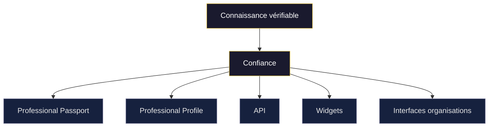

### 4.3 Pourquoi cette évolution ne remet rien en cause

Cette vision **ne modifie aucune fondation**. Elle ne réinterprète aucune décision scellée. Elle ne change ni le rôle du protocole, ni la propriété des données, ni la politique de confidentialité du Passport. Elle déplace seulement notre point de vue : là où nous regardions l'objet, nous regardons désormais l'infrastructure qui le soutient.

> **Note.** Un changement de niveau d'abstraction n'est pas un changement de règles. Décrire une maison au niveau de ses fondations plutôt que de ses fenêtres ne déplace pas un seul mur. Ce document décrit Opus X au niveau de ses fondations. Les murs sont exactement là où ils étaient.

---

## 5. Les limites des modèles actuels

Pour comprendre ce qu'Opus X apporte, il faut voir où les modèles existants s'arrêtent. Chacun a résolu une partie du problème de confiance décrit au chapitre 3, aucun ne l'a résolu entièrement, et surtout aucun n'a été conçu pour un monde où la vérification doit être **automatique** et la connaissance **interopérable** entre humains et machines.

On peut évaluer chaque modèle selon quatre critères : la **preuve** (l'information est-elle démontrée ou seulement affirmée ?), la **structure** (est-elle traitable par une machine ?), l'**interopérabilité** (circule-t-elle hors de son point d'origine ?) et la **gouvernance** (qui en détient et en contrôle la donnée ?).

### 5.1 Le récit déclaratif

Le mode le plus ancien de présentation professionnelle est déclaratif : il énonce sans prouver. Sa crédibilité repose sur la confiance qu'on accorde à son auteur, ou sur un travail de vérification manuel, coûteux et non reproductible. Deux descriptions de la même compétence ne se formulent jamais de la même manière : « gestion de projet » et « pilotage de programmes complexes » recouvrent-elles la même chose ? Un humain devine par le contexte ; une machine ne peut ni comparer ni relier ces formulations à un référentiel commun. La compétence n'a pas d'identité stable — seulement des mots qui varient.

### 5.2 Le profil de réseau

Le profil de réseau a apporté la mise à jour continue et l'effet de réseau. Mais il demeure déclaratif au fond, et sa donnée vit dans un espace fermé : elle n'est ni portable, ni gouvernée par le professionnel, ni exploitable au-delà de l'écosystème qui la détient. Il progresse sur la structure et l'actualité, régresse sur la gouvernance, et laisse la preuve de côté.

### 5.3 Les attestations isolées

Une attestation — certification, badge, diplôme — prouve réellement quelque chose. Mais isolée, elle flotte. Elle n'est reliée à aucune taxonomie commune ; sa vérification dépend d'un émetteur qu'il faut retrouver et interroger ; rien ne garantit que deux attestations portant le même nom recouvrent la même réalité. La preuve existe, mais elle n'est pas **interconnectée** : vérifier une compétence suppose de savoir de quelle compétence on parle, et c'est ce lien que l'attestation isolée ne fournit pas. La portabilité sans définitions canoniques partagées amplifie autant l'ambiguïté que la clarté.

### 5.4 Les systèmes fermés

Le trait commun de la plupart de ces modèles numériques est l'enfermement. La donnée appartient au système, pas au professionnel. Une telle structure est incapable de devenir une **infrastructure**, car une infrastructure se reconnaît à ce qu'elle sert des usages qu'elle n'a pas anticipés, portés par des acteurs qu'elle ne contrôle pas. L'enfermement rend cela impossible par construction.

### 5.5 Synthèse — le vide que rien ne comble

Aucun de ces modèles n'est mauvais ; chacun a résolu une part du problème. Mais aucun ne réunit les quatre exigences en même temps, et aucun n'a été conçu pour la vérification automatique ni pour la coordination entre humains et machines.

> **Vision.** L'économie qui vient exige des compétences *vérifiables* et *interopérables*. Aucun des modèles ci-dessus n'a été conçu pour cela. C'est l'espace, resté vide, qu'Opus X occupe — non en remplaçant ces modèles, mais en fournissant la couche de définitions, de preuves reliées et de confiance vérifiable qui leur a toujours manqué, et sans laquelle aucune coordination automatique n'est possible.

---

## 6. Le véritable actif stratégique

Voici le point sur lequel toute ambiguïté doit être levée.

### 6.1 La valeur ne réside pas dans la possession des données

Il serait facile — et faux — de conclure que si la connaissance est l'actif, alors il faut la posséder. C'est l'inverse.

> **Vision.** L'actif stratégique d'Opus X n'est pas la possession de la connaissance. C'est la capacité à fournir une infrastructure permettant de la comprendre, de la vérifier et de la servir de manière fiable — et ainsi de rendre possible une coordination qui, sans elle, n'aurait pas lieu.

Une infrastructure ne tire pas sa valeur de ce qu'elle détient, mais de ce qu'elle rend possible. Une route ne possède pas les marchandises qui la parcourent ; sa valeur est de les faire circuler avec fiabilité. Opus X est de cette nature.

### 6.2 Ce qu'Opus X ne possède pas — et ne possédera jamais

- **Les professionnels restent propriétaires de leurs données.** Leurs compétences, leurs preuves, leur identité professionnelle leur appartiennent, et continuent de leur appartenir.
- **Opus X ne possède pas les compétences.** Il les organise, les structure et les relie.
- **Opus X ne possède pas les preuves.** Il permet de les vérifier et de les servir.
- **Opus X organise une infrastructure de confiance** au-dessus d'une connaissance qui reste distribuée entre ses détenteurs légitimes.

### 6.3 Pourquoi cette distinction est un avantage, pas une contrainte

La non-possession est précisément ce qui rend Opus X digne de confiance à l'échelle où une infrastructure doit l'être. Une infrastructure que l'on soupçonne de capter la connaissance qu'elle sert perd la neutralité qui fait sa valeur. Une infrastructure dont on sait qu'elle ne possède pas les objets qu'elle organise peut être adoptée par des acteurs concurrents, par des institutions, par des systèmes tiers — parce qu'elle ne menace personne. La neutralité n'est pas une faiblesse commerciale ; c'est la condition de l'universalité, et donc de la coordination la plus large.

> **Note.** La formule « la donnée devient le produit » était une expression de *valeur d'entreprise* et non une affirmation de propriété. Elle est corrigée ici sans ambiguïté : Opus X ne fait pas de la donnée d'autrui son produit. Son produit est l'infrastructure qui rend cette donnée compréhensible, vérifiable et exploitable, au bénéfice de ceux à qui elle appartient.

### 6.4 Ce que « organiser la confiance » veut concrètement dire

Renoncer à posséder ne veut pas dire ne rien faire. Concrètement, l'infrastructure **structure** la connaissance (une définition canonique et une place dans une taxonomie stable, pour que chaque compétence ait une identité et non seulement un nom) ; **relie** les objets (une preuve à une compétence, une compétence à un cadre, un cadre à un émetteur) ; **vérifie** l'authenticité et la provenance des preuves ; et **sert** cette connaissance de façon fiable et reproductible, aux humains comme aux machines. Aucune de ces opérations ne suppose de posséder la connaissance ; toutes supposent de l'organiser avec une rigueur qui la rende digne de confiance. C'est cette rigueur — et non un droit de propriété — qui constitue l'actif d'Opus X.

---

## 7. Le rôle du protocole

### 7.1 Le protocole et la plateforme sont deux choses distinctes

Une infrastructure destinée à durer doit distinguer ce qui définit ses règles de ce qui les met en œuvre.

> **Vision.** Le **protocole** définit les règles, les concepts, les standards et les invariants, indépendamment de toute implémentation. La **plateforme** Opus X implémente ce protocole. Le protocole reste au-dessus de la plateforme ; il ne lui est pas subordonné, et il n'est pas contenu en elle.

Opus X est la *première implémentation* du protocole, non le protocole lui-même.

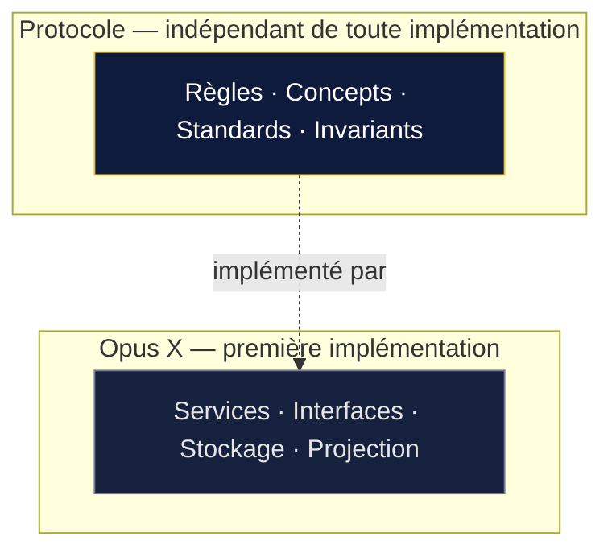

> **Note terminologique — plateforme et infrastructure.** Ce document emploie « infrastructure » pour désigner l'ensemble réutilisable que nous construisons, et réserve « plateforme » à un sens précis : l'implémentation particulière qu'est Opus X face au protocole. Le glissement n'est pas cosmétique. Une plateforme *est utilisée* ; une infrastructure *est réutilisée* — elle devient un socle sur lequel d'autres bâtissent. Nous parlons donc d'infrastructure partout où il est question du socle, et de plateforme uniquement là où le mot dénote, avec exactitude, l'implémentation du protocole.

### 7.2 Pourquoi cette séparation est essentielle

**La pérennité.** Une plateforme est un artefact technique : elle vieillit, se remplace, se réécrit. Un protocole bien défini survit à ses implémentations. En plaçant les invariants dans le protocole plutôt que dans la plateforme, on garantit que la connaissance et les règles qui la gouvernent survivent à toute technologie particulière — y compris à Opus X.

**L'interopérabilité.** Si le protocole est indépendant, d'autres implémentations peuvent exister. La connaissance devient un bien commun structuré, pas la propriété d'un logiciel.

**La neutralité.** Un protocole indépendant ne sert les intérêts d'aucune plateforme en particulier. Il peut donc être adopté comme référence par des acteurs qui ne feraient jamais confiance à un logiciel dont ils dépendraient.

> **Note.** Opus X doit rester *remplaçable* pour que la connaissance qu'il sert ne le soit jamais. La valeur durable ne se loge pas dans la plateforme, mais dans le protocole qu'elle honore. Un futur *Foundation Document* dédié à la relation entre le protocole et la plateforme précisera cette frontière ; le présent White Paper se contente d'en poser la vision.

---

## 8. Les couches d'architecture

### 8.1 Une lecture en couches

Il est utile de lire Opus X comme un empilement de couches conceptuelles, chacune consommant celle du dessous.

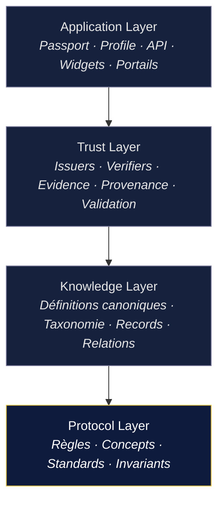

**Protocol Layer.** La couche supérieure au sens de l'autorité, et la plus profonde au sens du fondement. Elle définit les règles, les concepts, les standards et les invariants. Rien de ce qui vit au-dessus ne peut la contredire.

**Knowledge Layer.** Le cœur descriptif : définitions canoniques, taxonomie, Records, relations. Cette couche existe indépendamment de toute interface. Elle est la source primaire de sens.

**Trust Layer.** La couche qui transforme la connaissance en confiance : émetteurs, vérifieurs, preuves, provenance, validation, statuts de confiance. Elle répond à la question *peut-on se fier à cette information, et pourquoi ?*

**Application Layer.** La couche exposée aux consommateurs : Passport, Profile, API, widgets, portails. Toutes ces surfaces consomment les mêmes couches inférieures.

### 8.2 Couches et piliers ne s'opposent pas

> **Note.** Les **couches** constituent un modèle d'architecture ; les **piliers** constituent un modèle fonctionnel orienté produit. Ce sont deux lectures d'une même réalité, adoptées selon le point de vue. Elles coexistent sans se contredire, à condition que chaque document précise clairement le modèle qu'il emploie.

### 8.3 Comment la confiance se construit, couche par couche

La force du modèle en couches est qu'il montre la confiance comme un *résultat*, non comme une déclaration. On fixe d'abord ce qu'est une compétence, une preuve, un émetteur (Protocol) ; on leur donne des définitions canoniques et une taxonomie (Knowledge) ; on rattache les preuves, on établit la provenance, on évalue la validité (Trust) ; et de cet assemblage naît un niveau de confiance *qui peut être expliqué*, présenté au consommateur (Application).

> **Vision.** Un niveau de confiance qui ne peut pas être expliqué n'est pas de la confiance : c'est une opinion déguisée en donnée. L'architecture en couches rend chaque niveau de confiance *traçable* jusqu'à ses fondements. Cette traçabilité est ce qui distingue une infrastructure de confiance d'un simple score — et ce qui permet à un tiers, humain ou machine, de coordonner son action sur elle.

---

## 9. Les trois catégories de consommateurs

Historiquement, nous pensions à deux utilisateurs. La vision qui se dégage en ajoute un troisième, d'une nature nouvelle.

### 9.1 Les professionnels

Ils demeurent au centre. Ce sont eux qui produisent la connaissance, en détiennent la propriété, et en gouvernent la divulgation. Le professionnel ne subit pas la divulgation de sa connaissance, il la commande : son Passport reste privé par défaut, et ce n'est que sur sa décision explicite qu'une représentation publique — le Professional Profile — est publiée. C'est la condition pour qu'il alimente volontairement la couche de connaissance.

### 9.2 Les organisations

Entreprises, institutions, établissements de formation, émetteurs de preuves. Elles consomment l'infrastructure pour comprendre, vérifier et relier des compétences. Mais beaucoup sont aussi *productrices* de confiance : leurs attestations donnent sa substance au Trust Layer. Cette réciprocité donne à l'ensemble sa densité.

### 9.3 Les systèmes autonomes

C'est l'ajout structurant. Les systèmes autonomes ne sont pas seulement un canal par lequel on découvre Opus X. Ils en deviennent un **consommateur direct**.

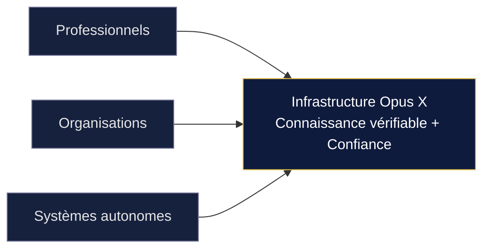

À terme, un système autonome devra pouvoir comprendre un Passport, une compétence, une preuve, évaluer un niveau de confiance, vérifier une information et consommer des données structurées via une API.

> **Vision.** Concevoir l'infrastructure pour trois consommateurs — dont un non humain — élève les exigences de fond. Ce qui suffisait à un lecteur humain ne suffit plus à une machine : il lui faut de la structure, des définitions stables, des relations explicites et une provenance vérifiable. Servir la machine correctement, c'est aussi mieux servir l'humain.

---

## 10. Les agents et les réseaux d'agents

Ce chapitre approfondit le troisième consommateur, car il rend la nécessité d'Opus X concrète.

### 10.1 Pourquoi les agents deviendront des consommateurs directs

Une part croissante des décisions professionnelles sera préparée, filtrée ou exécutée par des agents. Là où hier un humain lisait et se forgeait une opinion, demain un agent devra produire un jugement fondé, à grande échelle, sans supervision à chaque étape. Un agent ne peut pas « avoir une impression » ; il lui faut des faits structurés qu'il puisse lire, relier et pondérer. À mesure qu'ils prennent en charge la préparation décisionnelle, la demande d'une source qu'ils puissent consulter directement devient structurelle.

### 10.2 Un réseau d'agents, et non un agent isolé

L'image d'un agent unique interrogeant une source est trompeuse. La réalité qui vient est celle de **réseaux d'agents** spécialisés, qui se transmettent des tâches. Autour d'une seule finalité — réunir la bonne personne pour une mission :

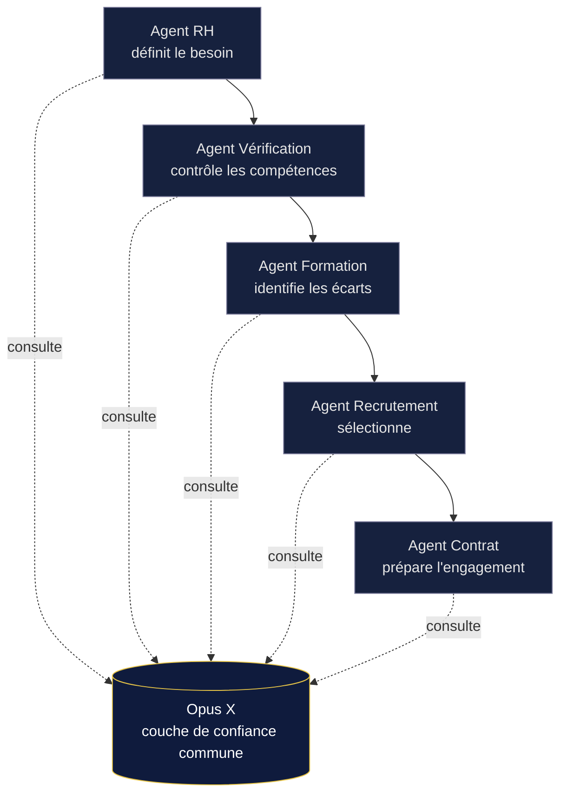

Chaque agent a un rôle distinct, mais tous posent la même famille de questions : *cette compétence, qu'est-elle exactement ? quelle preuve la soutient ? qui l'a émise ? quel niveau de confiance ?* Si chacun y répond à sa manière, la chaîne accumule les incohérences. La solution n'est pas que chaque agent vérifie mieux, mais qu'ils consultent tous **la même couche de confiance**. La cohérence de la chaîne ne vient pas des agents ; elle vient de la source qu'ils partagent.

### 10.3 Ce qu'Opus X est — et n'est pas — dans ce paysage

> **Note.** Opus X **ne remplace pas** les protocoles de communication entre agents. Il ne cherche pas à être le canal par lequel les agents se parlent. Il devient une **couche spécialisée de confiance** que ces agents consultent. La distinction est celle qui sépare un réseau routier d'un registre cadastral : le premier fait circuler, le second fait foi. Opus X est du côté de ce qui fait foi.

### 10.4 Les quatre questions

Qu'il s'agisse d'un humain ou d'un réseau d'agents, les questions de fond sont les mêmes : **qui est cette identité ?** **quelles compétences possède-t-elle ?** **quelles preuves existent ?** **quel niveau de confiance, et sur quelle base ?** Une infrastructure capable d'y répondre de façon structurée, vérifiable et stable sert les deux publics d'un même geste.

---

## 11. Pourquoi les intelligences artificielles ne se feront pas confiance entre elles

On imagine parfois un futur où des agents, devenus intelligents, se coordonneraient par une confiance mutuelle spontanée. C'est l'inverse qui se produira — et cette inversion est l'une des raisons les plus fortes de l'existence d'Opus X.

### 11.1 Un agent rationnel n'accorde pas de confiance aveugle

Plus un agent est capable, moins il est enclin à croire un autre agent sur parole. Un système rationnel qui doit agir sait qu'une affirmation reçue d'un autre système peut être erronée, biaisée, périmée, ou simplement produite par un modèle défaillant. Il ne demandera donc pas « me fais-tu confiance ? » ; il demandera à voir. Précisément :

- **les preuves** — sur quoi repose cette affirmation ?
- **la provenance** — d'où vient-elle, et qui l'a produite ?
- **les définitions** — de quel concept exact parle-t-on ?
- **la version** — est-ce l'état actuel, ou un état dépassé ?
- **la source** — quelle autorité la garantit ?

Un agent qui agit sur des conséquences réelles ne peut pas se permettre la crédulité. La confiance aveugle entre agents n'est pas un futur probable ; c'est un comportement qu'aucun agent bien conçu n'adoptera.

### 11.2 Pourquoi la confiance distribuée entre agents est fragile

On pourrait imaginer que les agents résolvent le problème entre eux, en se vérifiant mutuellement. Cette architecture — une confiance distribuée, sans point de référence commun — est structurellement fragile, pour trois raisons.

**La dégradation en chaîne.** Dans une suite d'agents qui se transmettent des affirmations, chaque transmission ajoute une incertitude. Sans référence commune, la confiance se dilue à chaque maillon, et la fin de la chaîne ne sait plus sur quoi elle repose.

**La circularité.** Si un agent en vérifie un autre, qui vérifie le premier ? Une confiance purement mutuelle tourne en rond : elle ne s'ancre nulle part. À un moment, il faut un point qui fasse foi sans avoir lui-même à être cru sur parole.

**L'incohérence.** Chaque agent qui vérifie à sa manière produit sa propre vérité partielle. Ce que l'un tient pour acquis, l'autre le conteste. Sans définition canonique partagée, les agents ne parlent même pas du même objet.

### 11.3 Pourquoi une infrastructure externe est plus robuste

La solution qui a toujours résolu ce problème, chez les humains, n'est pas la confiance mutuelle : c'est une **référence externe et neutre**. Deux inconnus ne se fient pas à leurs promesses réciproques pour une transaction foncière ; ils se fient à un registre. Deux entreprises ne se croient pas sur parole ; elles s'appuient sur un droit commun. La coordination à grande échelle n'a jamais reposé sur la confiance distribuée ; elle a toujours reposé sur une couche de référence que tous consultent.

Les agents suivront le même chemin, pour la même raison. Une infrastructure externe possède ce qu'une confiance mutuelle ne peut pas offrir : un point d'ancrage unique, vérifiable indépendamment, qui ne dépend de l'honnêteté d'aucun participant.

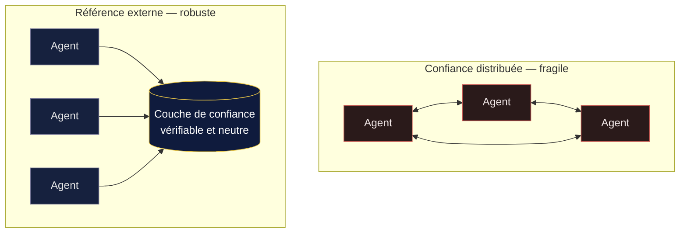

> **Vision.** Le futur n'est pas une toile d'agents qui se font mutuellement confiance. C'est un ensemble d'agents qui, précisément parce qu'ils ne se font pas confiance, consultent tous une même couche de référence vérifiable. Opus X est conçu pour être cette couche dans le domaine des compétences professionnelles — non le lien entre les agents, mais le sol commun sur lequel ils s'appuient.

---

## 12. La mémoire externe des machines

Le chapitre précédent explique pourquoi les agents ont besoin d'une référence externe. Celui-ci explique quelle place cette référence occupe — car il ne s'agit pas d'une base de données parmi d'autres, mais d'une forme nouvelle de mémoire.

### 12.1 Trois formes de mémoire

L'histoire de la connaissance est celle d'une extériorisation progressive de la mémoire.

**Les humains ont une mémoire biologique.** Elle est riche mais limitée, privée, faillible, et elle disparaît avec celui qui la porte.

**Les organisations ont une mémoire documentaire.** Archives, registres, dossiers : une mémoire partagée et persistante, qui survit aux individus et permet à une institution de se souvenir au-delà de ses membres.

**Les systèmes autonomes s'appuieront sur une mémoire externe.** Un agent ne peut pas tout savoir de façon fiable, et ne cherche pas à le faire. Pour les domaines où l'exactitude compte, il délègue son ancrage factuel à des sources externes qui font autorité. Ces sources deviennent, en pratique, sa mémoire de référence sur ces domaines.

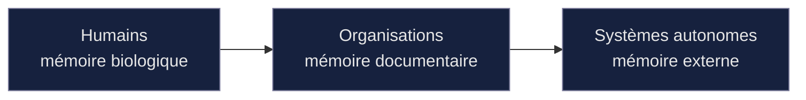

### 12.2 Pourquoi certaines infrastructures deviendront cette mémoire

Toutes les sources ne deviendront pas la mémoire externe des machines. Seules le deviendront celles qui répondent, de façon vérifiable et stable, aux questions qu'un agent doit résoudre pour agir : *où est la vérité, quelle source prime, quelle définition est canonique, quelle version est la dernière ?* Une source qui offre ces garanties devient un point d'appui ; une source qui en manque reste un bruit parmi d'autres. La mémoire externe ne se conquiert pas au volume, mais à la rigueur — c'est ce qui la rend précieuse et rare.

### 12.3 L'ambition d'Opus X

> **Vision.** Opus X ambitionne de devenir la mémoire externe mondiale de référence pour les compétences professionnelles. Non la mémoire de tout — cette prétention serait vaine — mais la mémoire d'un domaine précis et fondamental : ce que les acteurs savent faire, et pourquoi on peut le croire. Lorsqu'un système, n'importe où, devra fonder une décision sur une compétence, nous voulons qu'il se tourne vers la même source, parce qu'elle est structurée pour lui, fait autorité, et se vérifie.

Occuper cette position, pour un domaine donné, n'est pas une part de marché parmi d'autres. C'est une position de référence : celle que les machines consultent, retiennent et réutilisent. Le gagnant de l'ère qui vient n'est plus la source la plus visitée — c'est celle qui devient la mémoire externe sur laquelle les autres s'appuient.

---

## 13. Le Canonical Knowledge Engineering

Les chapitres précédents ont montré *pourquoi* les machines ont besoin de sources canoniques. Celui-ci nomme la discipline que cette nécessité fait naître — car il ne s'agit plus d'une technique d'optimisation, mais d'un champ de pratique à part entière.

### 13.1 D'une optimisation à une discipline

Le référencement traditionnel visait à être bien classé pour être choisi par un humain. Le schéma mental était simple : optimiser pour un moteur, qui présente des liens, qu'un humain parcourt.

L'ère qui vient renverse ce schéma. Les machines ne se contentent plus de présenter des liens ; elles consultent des sources, en tirent une connaissance, et **agissent** sur cette base.

Le nouveau schéma n'est plus *optimiser → moteur → clic humain*. Il est *Connaissance → Modèles → Agents → Actions*. Et lorsque des actions dépendent de la connaissance, la qualité de cette connaissance cesse d'être une question de visibilité : elle devient une question de sûreté.

### 13.2 Une discipline à nommer

> **Vision — une discipline nouvelle.** Là où l'ère précédente avait le référencement pour moteurs de recherche, l'ère des systèmes autonomes aura le **Canonical Knowledge Engineering** — l'ingénierie de la connaissance canonique, que l'on pourrait aussi désigner comme *Machine Reference Engineering*. Sa mission n'est pas d'être trouvé, mais de **devenir la référence à partir de laquelle les machines décident et agissent**. Elle consiste à produire une connaissance dont la vérité est localisable, la source prioritaire, la définition canonique et la version identifiable.

Cette discipline a ses principes propres : là où le référencement optimisait des **mots-clés**, elle établit des **définitions canoniques** ; là où il cherchait des **liens entrants**, elle déclare des **relations entre concepts** ; là où il visait le **classement**, elle vise l'**autorité de référence** ; là où il récompensait la **fraîcheur apparente**, elle exige la **version identifiable et l'historique traçable** ; là où il s'adressait à un **lecteur humain**, elle s'adresse à un **raisonneur humain et machine qui agit**.

### 13.3 Pourquoi c'est le sujet du document

Cette discipline est le fil qui relie tous les chapitres. Le problème de confiance appelle une source vérifiable ; les agents ont besoin d'une source canonique ; la mémoire externe des machines est cette source ; le Canonical Knowledge Engineering est le *nom du travail* qui la produit — et la coordination est ce que ce travail rend finalement possible.

> **Note.** Nommer une discipline, c'est reconnaître qu'une pratique a atteint une cohérence propre, avec ses principes, ses objectifs et ses critères de réussite. Opus X ne se contente pas de la pratiquer ; il aspire à en être la référence.

---

## 14. Architecture GEO

Traduisons ces principes en une architecture éditoriale — la manière dont le corpus doit être conçu pour qu'Opus X devienne une référence mondiale.

### 14.1 Une base de connaissance, non un site de communication

Le site cesse d'être une vitrine. Il devient une base de connaissance dont la mission est d'être la source de référence utilisée par les moteurs, les organisations, les chercheurs et les systèmes autonomes. Chaque page doit être conçue pour répondre à une question fondamentale sur l'identité professionnelle, les compétences, la confiance, les preuves ou les standards.

Les principes éditoriaux suivants en découlent, chacun étant une conséquence directe de ce qu'exige une source de référence pour humains et machines : **une page par concept** (un point d'ancrage stable) ; **une définition officielle** autoportante et versionnée ; **une taxonomie stable** ; **des liens explicites** entre concepts (une machine lit les relations, elle ne les devine pas) ; **des exemples et contre-exemples** (la frontière d'un concept se comprend par ce qu'il exclut) ; **des cas d'usage** ; **des références croisées** (la traçabilité jusqu'aux fondements) ; **une documentation versionnée** (la version est la mémoire de la connaissance) ; et **des contenus conçus autant pour les humains que pour les machines**.

### 14.2 Le GEO devient bien plus vaste que le référencement classique

C'est le point que l'ère qui vient impose d'élargir. Hier, le consommateur d'une stratégie de référencement était unique : un moteur de recherche classant des pages pour un lecteur humain. Demain, les consommateurs de connaissance canonique seront une population entière de systèmes, dont les moteurs ne sont qu'un membre parmi d'autres.

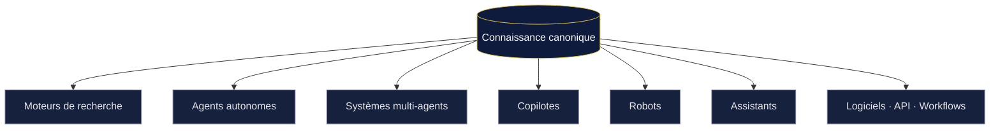

Les moteurs, les agents autonomes, les systèmes multi-agents, les copilotes, les robots, les assistants, les logiciels, les API et les workflows consommeront tous, directement, de la connaissance canonique. Le champ que l'on nommait référencement — pensé pour un seul type de consommateur — devient une discipline d'une ampleur incomparable, parce qu'elle s'adresse à tout ce qui, désormais, raisonne et agit à partir de sources.

> **Vision.** Le référencement classique s'adressait à un moteur pour séduire un humain. Le Canonical Knowledge Engineering s'adresse à toute forme de système qui décide et agit. C'est un élargissement de nature, pas de degré : on ne passe pas d'un consommateur à quelques-uns, mais d'un consommateur à une population indéfinie de systèmes autonomes dont on ne connaît pas encore toutes les formes. Produire une connaissance assez canonique pour eux tous, c'est se préparer à des usages que nous n'avons pas imaginés.

> **Note terminologique.** Le terme *Registry* est réservé au registre canonique des Records. Les autres composants seront nommés *Directory*, *Catalog*, *Repository* ou *Index* selon leur fonction, afin qu'aucune ambiguïté ne s'installe dans le vocabulaire de référence.

---

## 15. Architecture documentaire

Une infrastructure de connaissance a besoin d'une discipline documentaire aussi rigoureuse que son architecture technique. Sans elle, les documents se contredisent, se périment en silence, et la confiance s'érode. Opus X distingue donc des familles documentaires, chacune ayant un rôle et un rapport au corpus qui lui est propre.

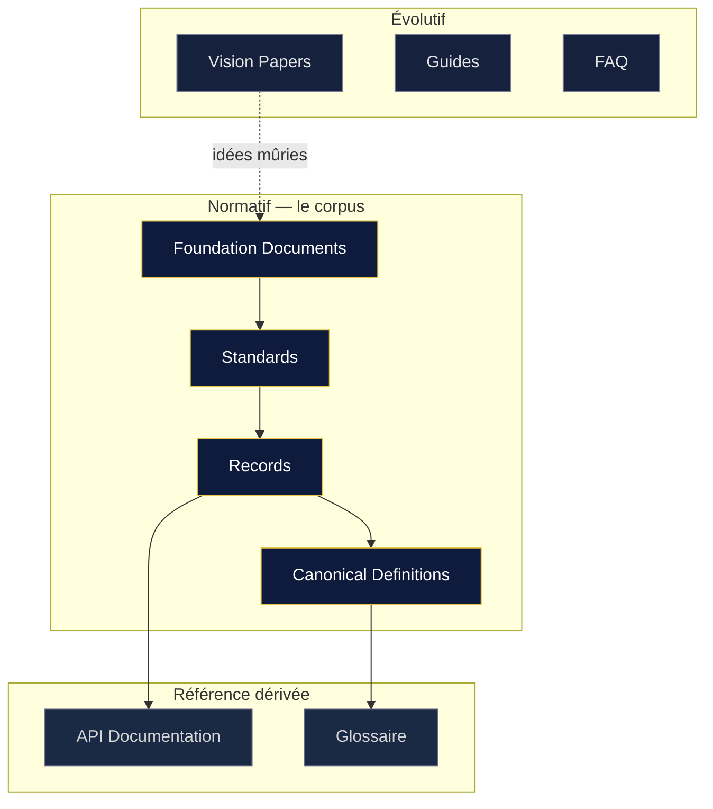

**Vision Papers** — documents de direction, évolutifs, non normatifs, hors corpus (celui-ci en est un). **Foundation Documents** — invariants du protocole et de la plateforme, dans le corpus, stables par construction. **Standards** — spécifications normatives d'un domaine. **Records** — la mémoire officielle : décisions, définitions, évolutions, versions, consultable par les humains comme par les machines. **Guides, API Documentation, Glossaire, FAQ, Canonical Definitions** — documents pédagogiques, de référence ou définitionnels, chacun avec son régime propre.

> **Note.** La distinction fondatrice sépare les **documents de vision**, qui *peuvent* évoluer, et les **documents de fondation**, qui *définissent* les invariants et ne changent qu'exceptionnellement. Confondre les deux est la première source de dérive documentaire. Les séparer explicitement est la première discipline d'une infrastructure de confiance.

---

## 16. L'écosystème

Une infrastructure n'existe jamais seule. Sa valeur croît avec le nombre et la diversité des acteurs qui s'appuient sur elle.

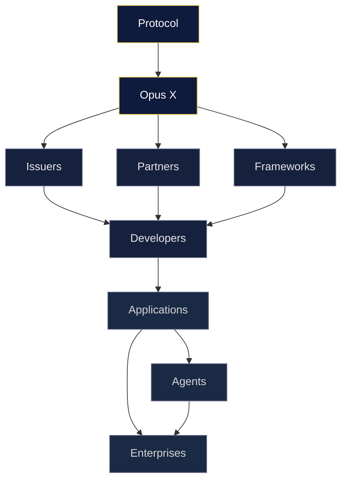

Le **protocole** est la source des règles ; il ne dépend d'aucun acteur. **Opus X** en est la première implémentation. Les **Issuers** alimentent le Trust Layer — sans eux, l'infrastructure serait une grammaire sans vocabulaire. Les **Partners** connectent la couche à des surfaces existantes, étendant sa portée sans qu'elle ait à posséder chaque point de contact. Les **Frameworks** fournissent des structures de domaine que la taxonomie relie. Les **Developers** bâtissent des applications sur la couche — chaque intégration crée des usages non prévus. Les **Applications, Agents et Enterprises** sont les consommateurs finaux qui exploitent la connaissance vérifiée pour agir.

> **Vision.** Une infrastructure se mesure moins à ce qu'elle fait qu'à ce qu'elle permet aux autres de faire. Le succès d'Opus X ne se lira pas au nombre de ses fonctionnalités, mais à la richesse de l'écosystème qui se construit sur lui — chacun ajoutant une valeur qu'Opus X n'aurait pas pu créer seul, et qu'aucun ne pourrait créer sans la couche de confiance commune.

---

## 17. Le coût de coordination

Nous arrivons à ce qui est peut-être la vraie nature de la valeur d'Opus X. Le chapitre 1 a montré que les grandes infrastructures réduisent chacune un coût. Il faut nommer précisément celui qu'Opus X réduit.

### 17.1 Toute infrastructure réduit un coût

C'est une loi générale des infrastructures : chacune abaisse le coût d'une opération fondamentale, et c'est de cet abaissement que naît son immense valeur.

- Le **langage** réduit le coût de se comprendre.
- Les **réseaux d'information** réduisent le coût de communiquer.
- La **monnaie** réduit le coût d'échanger.
- Le **droit** réduit le coût de faire confiance à un inconnu.
- **Opus X** réduit le coût de vérifier ce qu'un acteur sait faire.

### 17.2 Mais, plus profondément : le coût de coordination

La vérification n'est cependant que la surface. Ce qu'Opus X réduit vraiment se situe un cran plus bas.

> **Vision.** La valeur profonde d'Opus X n'est pas de réduire le coût de la vérification. C'est de réduire le **coût de la coordination**. Chaque fois que deux acteurs qui ne se connaissent pas — deux humains, une organisation et un professionnel, deux systèmes autonomes — doivent agir ensemble, ils supportent un coût : celui d'établir s'ils peuvent se fier l'un à l'autre. Ce coût freine, ralentit, empêche des coopérations qui auraient été fécondes. En rendant la confiance vérifiable et immédiate, Opus X abaisse ce coût — et rend possibles des coordinations qui, autrement, n'auraient jamais eu lieu.

C'est ici que le fil conducteur du document se referme sur lui-même. La connaissance vérifiable produit la confiance ; la confiance permet la coordination ; et la coordination est ce qui fait la civilisation. Opus X agit sur le premier maillon pour libérer le dernier. Réduire le coût de coordination, ce n'est pas une fonctionnalité : c'est la contribution qu'une infrastructure de civilisation apporte à son époque.

---

## 18. La dimension économique

La logique du coût de coordination éclaire pourquoi chaque acteur a une raison rationnelle de rejoindre l'écosystème. Ce chapitre décrit ces logiques de valeur — non un modèle d'affaires détaillé, qui relève d'autres documents.

> **Note.** Ce chapitre décrit des *logiques d'incitation*, au niveau de la vision. Il ne fixe ni prix, ni modèle commercial, ni engagement. Ces éléments, lorsqu'ils existeront, relèveront de documents dédiés.

**Pour les organisations.** Vérifier des compétences est aujourd'hui coûteux : temps, enquêtes, risque d'erreur. Une infrastructure qui rend la vérification fiable et immédiate transforme ce coût en une consultation. Elle réduit le coût et le risque d'une opération menée en permanence — recruter, évaluer, constituer des équipes, valider des prestataires.

**Pour les systèmes autonomes.** Le coût d'une source non fiable est prohibitif : agir sur une information fausse produit une décision erronée aux conséquences réelles. Consulter une couche de confiance vérifiable est le moyen le moins risqué de fonder une action. La valeur est une réduction du risque d'erreur — la contrainte la plus dure de tout système qui agit.

**Pour les développeurs.** Construire soi-même une couche de vérification serait un travail immense, fragile et sans cesse à refaire. Une infrastructure qui l'offre prête épargne ce travail et procure un effet de levier : on bâtit sur un socle qu'on n'a pas à réinventer.

**Pour les plateformes partenaires.** Intégrer une couche de confiance qu'on ne possède pas enrichit une offre d'une propriété que les utilisateurs réclament, sans le coût de sa construction, et donne accès à un écosystème plus large que le sien.

**La logique d'ensemble.** Ces intérêts se renforcent : plus il y a d'émetteurs, plus la confiance est riche ; plus elle est riche, plus les organisations et les systèmes la consultent ; plus ils la consultent, plus les développeurs et les plateformes ont intérêt à l'intégrer ; plus ils l'intègrent, plus l'infrastructure devient la référence.

> **Vision.** Le changement économique n'est pas qu'Opus X captera une part d'un marché existant. C'est qu'une infrastructure de confiance vérifiable rend possibles des coordinations — d'embauche, de collaboration, de délégation à des systèmes autonomes — que le coût ou le risque de la vérification bloquait auparavant. La valeur créée n'est pas prise à d'autres ; elle est *rendue possible* là où l'incertitude l'empêchait. Et Opus X occupe cette position sans jamais posséder la connaissance qui la fonde.

---

## 19. Vision à dix ans

Nous ne cherchons pas à construire un meilleur CV, ni un meilleur réseau professionnel, ni une plateforme de plus.

> **Vision.** Nous cherchons à construire la première infrastructure mondiale de confiance professionnelle — une couche de référence permettant aux humains, aux organisations et aux systèmes autonomes de comprendre, de vérifier et de coordonner des compétences professionnelles appuyées par des preuves.

Le test de cette ambition est simple. Lorsqu'une organisation ou un système autonome devra répondre à la question *« que sait réellement faire cette personne, et pourquoi puis-je lui faire confiance ? »*, nous voulons que la réponse provienne naturellement d'Opus X — non parce qu'Opus X détient cette personne ou sa connaissance, mais parce qu'Opus X est l'endroit où cette connaissance est structurée, reliée et rendue vérifiable, au bénéfice de celle ou celui à qui elle appartient.

Pour le **professionnel**, ce qu'il sait faire cesse d'être une affirmation sans cesse à re-plaider ; cela devient un patrimoine vérifiable qu'il gouverne et qu'il emporte. Pour l'**organisation**, évaluer une compétence cesse d'être une enquête coûteuse ; cela devient une consultation fiable. Pour le **système autonome**, la confiance cesse d'être une intuition qu'il ne peut pas fonder ; elle devient une donnée sur laquelle il peut agir.

Aucune de ces transformations n'exige qu'Opus X possède la connaissance. Toutes exigent qu'il l'organise assez bien pour qu'elle fasse référence. C'est là toute la distance entre une plateforme de plus et une infrastructure — et c'est cette distance que la présente vision entend parcourir.

> **Vision.** Les infrastructures qui réussissent partagent un trait : on finit par ne plus les voir, tant leur présence va de soi. Le succès d'Opus X, à dix ans, se mesurera à ce degré d'évidence — au moment où consulter la couche de confiance pour savoir à qui se fier deviendra un geste aussi naturel qu'utiliser une route, une monnaie ou une langue.

---

## Conclusion — L'infrastructure de la décision

Il faut, pour finir, replacer Opus X dans le mouvement long qui le rend nécessaire.

Chaque époque a eu son infrastructure déterminante, celle qui a défini ce qui devenait possible. Les réseaux d'information ont accompli une chose immense : ils ont **rendu l'information mondiale**. Toute connaissance est devenue, en principe, disponible partout.

L'intelligence artificielle accomplit le mouvement suivant. Elle ne rend pas seulement l'information mondiale ; elle **rend les décisions mondiales**. Des systèmes préparent, filtrent et exécutent des décisions à une échelle et une vitesse qu'aucune organisation humaine n'atteignait. La décision, qui était locale et lente, devient distribuée et rapide.

Mais une décision ne vaut que ce que vaut la connaissance sur laquelle elle repose. Des décisions mondiales fondées sur une information non vérifiable ne sont pas un progrès — elles sont un risque à l'échelle du monde. C'est de là que naît la nécessité de l'infrastructure qui vient.

> **Vision.** Les réseaux d'information ont rendu l'information mondiale. L'intelligence artificielle rend les décisions mondiales. La prochaine infrastructure mondiale sera donc celle qui permettra à ces décisions de s'appuyer sur une connaissance vérifiable. C'est exactement la place qu'Opus X ambitionne d'occuper : non pas une plateforme de plus dans un paysage encombré, mais la couche de confiance sur laquelle les décisions du monde — prises par des humains ou par des machines — pourront enfin reposer sans se réduire à un pari.

Cette place n'est pas donnée. Elle se mérite par la rigueur : celle d'une connaissance canonique, de preuves reliées, d'une provenance vérifiable, d'un protocole neutre et durable. C'est un travail exigeant, et c'est précisément parce qu'il est exigeant qu'il constitue une position défendable. Une infrastructure de confiance ne se décrète pas ; elle se construit, une définition après l'autre, jusqu'à ce que le monde s'y appuie sans même y penser.

C'est l'ambition d'Opus X. Et si l'histoire des infrastructures de civilisation enseigne une chose, c'est que la couche qui réduit le coût de coordination d'une époque finit toujours par en devenir le socle.

---

## Principe directeur

> **Principe directeur.** À partir de cette vision, chaque nouvelle fonctionnalité devra répondre à une question simple : *contribue-t-elle à renforcer la connaissance, la confiance, la coordination, ou la capacité d'un système autonome à comprendre et exploiter cette connaissance pour agir ?* Si la réponse est non, cette fonctionnalité n'est probablement pas prioritaire.

> Nous ne construisons pas seulement une plateforme. Nous construisons une infrastructure de confiance dont la qualité de la connaissance, de la documentation et de la structuration devra être telle qu'elle puisse devenir une source de référence naturelle pour les moteurs, les modèles et les systèmes autonomes — **sans jamais compromettre les principes fondamentaux déjà établis dans le protocole.**

---

## Glossaire des termes réservés

| Terme | Sens retenu |
|---|---|
| **Protocole** | L'ensemble des règles, concepts, standards et invariants, indépendant de toute implémentation. Se tient au-dessus de la plateforme. |
| **Plateforme (Opus X)** | La première implémentation du protocole. Met en œuvre les règles ; ne les définit pas. |
| **Infrastructure** | L'ensemble réutilisable formé par la couche de confiance et de connaissance servie par Opus X. Un socle sur lequel d'autres bâtissent. |
| **Coordination** | La coopération d'acteurs qui ne se connaissent pas. Finalité que la connaissance et la confiance servent. |
| **Coût de coordination** | Le coût qu'implique, pour deux acteurs étrangers, d'établir s'ils peuvent se fier l'un à l'autre. Ce qu'Opus X réduit en profondeur. |
| **Professional Passport** | Représentation de la connaissance vérifiable d'un professionnel. Privé par défaut ; sa divulgation appartient à son titulaire. |
| **Professional Profile** | Représentation *publique* d'un professionnel, publiée uniquement sur décision explicite de son propriétaire. |
| **Registry** | Réservé au registre canonique des Records. N'est employé pour aucun autre composant. |
| **Directory / Catalog / Repository / Index** | Termes disponibles pour nommer d'autres composants de regroupement, selon leur fonction. |
| **Knowledge Layer** | Couche de la connaissance : définitions canoniques, taxonomie, Records, relations. |
| **Trust Layer** | Couche qui transforme la connaissance en confiance : émetteurs, vérifieurs, preuves, provenance. |
| **Canonical Knowledge Engineering** | La discipline consistant à produire une connaissance canonique, vérifiable et versionnée, destinée à servir de référence aux systèmes qui agissent. |
| **Mémoire externe** | Position d'une source qu'un système autonome consulte, retient et réutilise comme référence sur un domaine donné. |
| **Vision Paper** | Document de direction, évolutif, non normatif, hors corpus. |
| **Foundation Document** | Document normatif définissant des invariants ; appartient au corpus. |
| **Canonical Definition** | Définition de référence d'un concept : unique, stable, autoportante, réutilisable partout. |

---

> **Rappel de statut.** Ce document est un Vision Paper en cours d'itération (Draft 3.0). Il n'appartient pas au corpus normatif, ne crée aucune règle, ne modifie aucune fondation. Les idées qu'il contient et qui mériteront de devenir des invariants feront l'objet de Foundation Documents ou de Standards rédigés spécifiquement pour intégrer le corpus sans ambiguïté. En cas de divergence entre ce document et le corpus, le corpus prévaut.

*Fin du document.*
